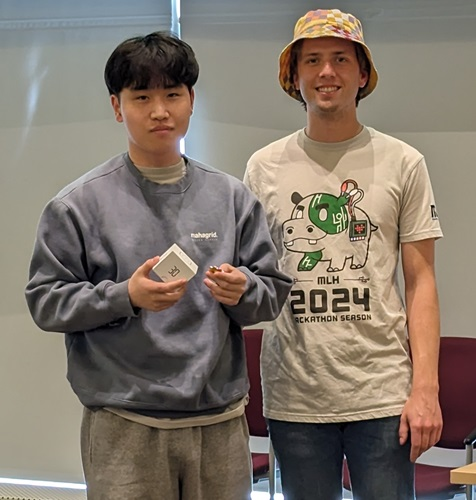

# DailyLang 🌍🗣️

  

DailyLang is an innovative language learning app that focuses on practical expression discovery and real-time video translation, leveraging the power of AI to accelerate language proficiency.

## 🌟 Features

- **AI-Powered Chatbot**: Get practical translations for everyday expressions
- **Real-time Video Translation**: Translate content from YouTube, Instagram, Facebook, and more
- **Expression Saving**: Store and review translated phrases for continued learning
- **Customizable Learning**: Choose your mother tongue and target language

## 🛠️ Technology Stack

- **Android** with Kotlin
- **MVVM Architecture**
- **OpenAI** for natural language processing
- **Google Cloud Speech-to-Text API**
- **Room Database** for local storage
- **MediaProjection API** for audio capture

## 🏗️ How It's Built

1. **MVVM Pattern**: Enhances maintainability and reduces code duplication
2. **OpenAI Integration**: Refined prompts for effective communication
3. **Audio Capture**: Utilizes Android's MediaProjection API to access phone's speaker system
4. **Real-time Translation**: Leverages Google Cloud's Speech-to-Text API for instant language processing

## 🏅 Achievements

- Winner of "Best Use of AI in Education" at CEWIT HACK 2024
- Innovative approach to internal audio capture and processing

## 🚀 Future Plans

- Implement computer vision for text recognition and translation
- Add text-to-speech functionality for vocalization of sentences

## 👤 Author

**Sung Min Joh**

* GitHub: [@joh9911](https://github.com/joh9911)
* Devpost: [Sung Min Joh](https://devpost.com/joh9911)

## 🙏 Acknowledgments

- CEWIT HACK 2024 organizers and judges

---

